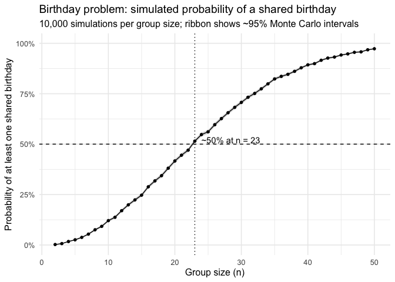
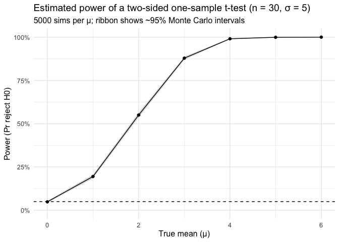
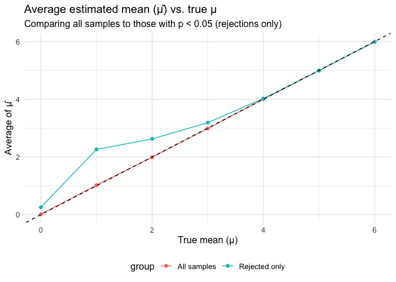
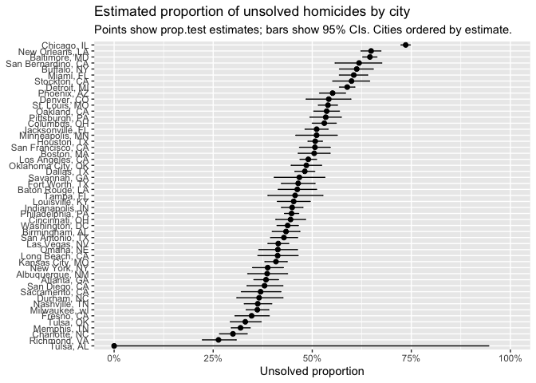

p8105_hw5_km4071
================
km4071
2025-11-09

- [Question 2](#question-2)
- [Question 3](#question-3)

``` r
set.seed(8105)
library(tidyverse)
```

    ## ── Attaching core tidyverse packages ──────────────────────── tidyverse 2.0.0 ──
    ## ✔ dplyr     1.1.4     ✔ readr     2.1.5
    ## ✔ forcats   1.0.0     ✔ stringr   1.5.1
    ## ✔ ggplot2   3.5.2     ✔ tibble    3.3.0
    ## ✔ lubridate 1.9.4     ✔ tidyr     1.3.1
    ## ✔ purrr     1.1.0     
    ## ── Conflicts ────────────────────────────────────────── tidyverse_conflicts() ──
    ## ✖ dplyr::filter() masks stats::filter()
    ## ✖ dplyr::lag()    masks stats::lag()
    ## ℹ Use the conflicted package (<http://conflicted.r-lib.org/>) to force all conflicts to become errors

``` r
library(broom)
```

``` r
share_birthday <- function(n, days = 365) {
  bdays <- sample.int(days, size = n, replace = TRUE)
  any(duplicated(bdays))
}
```

``` r
sim_prob <- function(n, reps = 10000L) {
  mean(replicate(reps, share_birthday(n)))
}

results <- tibble(n = 2:50) |>
  mutate(
    prob  = purrr::map_dbl(n, sim_prob, reps = 10000L),
    se    = sqrt(prob * (1 - prob) / 10000),
    lower = pmax(0, prob - 1.96 * se),
    upper = pmin(1, prob + 1.96 * se)
  )


n_at_least_50 <- results |>
  filter(prob >= 0.5) |>
  slice_head(n = 1) |>
  pull(n)

prob_23 <- results |> filter(n == 23) |> pull(prob)
prob_50 <- results |> filter(n == 50) |> pull(prob)

results
```

    ## # A tibble: 49 × 5
    ##        n   prob       se   lower   upper
    ##    <int>  <dbl>    <dbl>   <dbl>   <dbl>
    ##  1     2 0.0024 0.000489 0.00144 0.00336
    ##  2     3 0.007  0.000834 0.00537 0.00863
    ##  3     4 0.0173 0.00130  0.0147  0.0199 
    ##  4     5 0.0258 0.00159  0.0227  0.0289 
    ##  5     6 0.0378 0.00191  0.0341  0.0415 
    ##  6     7 0.0539 0.00226  0.0495  0.0583 
    ##  7     8 0.0755 0.00264  0.0703  0.0807 
    ##  8     9 0.0925 0.00290  0.0868  0.0982 
    ##  9    10 0.121  0.00326  0.115   0.127  
    ## 10    11 0.138  0.00344  0.131   0.144  
    ## # ℹ 39 more rows

``` r
ggplot(results, aes(x = n, y = prob)) +
  geom_ribbon(aes(ymin = lower, ymax = upper), alpha = 0.20) +
  geom_line() +
  geom_point(size = 1.3) +
  geom_hline(yintercept = 0.5, linetype = 2) +
  geom_vline(xintercept = n_at_least_50, linetype = 3) +
  annotate(
    "text",
    x = n_at_least_50 + 1, y = 0.52,
    label = paste0("~50% at n = ", n_at_least_50),
    hjust = 0
  ) +
  scale_y_continuous(
    limits = c(0, 1),
    labels = scales::label_percent(accuracy = 1)
  ) +
  labs(
    title = "Birthday problem: simulated probability of a shared birthday",
    subtitle = "10,000 simulations per group size; ribbon shows ~95% Monte Carlo intervals",
    x = "Group size (n)",
    y = "Probability of at least one shared birthday"
  ) +
  theme_minimal(base_size = 12)
```

<!-- --> The
simulation shows the classic “birthday paradox”: even with uniformly
distributed birthdays over 365 days, the chance of at least one match
rises nonlinearly with group size because the number of possible pairs
grows as n(n-1)/2. The estimated probability crosses 50% around n≈23,
and then climbs quickly, exceeding ~90% by the low 40s and approaching
near certainty by n=50. This matches the analytical benchmark and
highlights how rapidly collision probabilities accumulate as groups get
modestly larger.

# Question 2

``` r
set.seed(8105)
n <- 30
sigma <- 5
mu_grid <- 0:6
reps <- 5000L
alpha <- 0.05
```

``` r
simulate_once <- function(mu, n = 30, sigma = 5) {
  x <- rnorm(n, mean = mu, sd = sigma)
  tt <- t.test(x, mu = 0)
  tibble(
    mu      = mu,
    mu_hat  = mean(x),
    p_value = tidy(tt)$p.value
  )
}
```

``` r
sim_results <- map_dfr(
  mu_grid,
  ~ bind_rows(replicate(reps, simulate_once(.x, n, sigma), simplify = FALSE))
)

dplyr::glimpse(sim_results)
```

    ## Rows: 35,000
    ## Columns: 3
    ## $ mu      <int> 0, 0, 0, 0, 0, 0, 0, 0, 0, 0, 0, 0, 0, 0, 0, 0, 0, 0, 0, 0, 0,…
    ## $ mu_hat  <dbl> 1.42930827, 0.32775353, 0.42672084, -0.26088699, 0.43733318, 0…
    ## $ p_value <dbl> 0.12130834, 0.75577047, 0.61020379, 0.79747728, 0.66665629, 0.…

``` r
power_tbl <- sim_results |>
  group_by(mu) |>
  summarize(
    power = mean(p_value < alpha),
    mc_se = sqrt(power * (1 - power) / n()),
    .groups = "drop"
  )

power_tbl
```

    ## # A tibble: 7 × 3
    ##      mu  power    mc_se
    ##   <int>  <dbl>    <dbl>
    ## 1     0 0.0486 0.00304 
    ## 2     1 0.195  0.00560 
    ## 3     2 0.55   0.00704 
    ## 4     3 0.879  0.00462 
    ## 5     4 0.991  0.00136 
    ## 6     5 0.999  0.000400
    ## 7     6 1      0

``` r
ggplot(power_tbl, aes(x = mu, y = power)) +
  geom_ribbon(aes(ymin = pmax(0, power - 1.96 * mc_se),
                  ymax = pmin(1, power + 1.96 * mc_se)),
              alpha = 0.20) +
  geom_line() +
  geom_point(size = 1.6) +
  geom_hline(yintercept = 0.05, linetype = 2) +
  scale_y_continuous(limits = c(0, 1), labels = scales::label_percent(accuracy = 1)) +
  labs(
    title = "Estimated power of a two-sided one-sample t-test (n = 30, σ = 5)",
    subtitle = "5000 sims per μ; ribbon shows ~95% Monte Carlo intervals",
    x = "True mean (μ)",
    y = "Power (Pr reject H0)"
  ) +
  theme_minimal(base_size = 12)
```

<!-- -->

``` r
avg_all <- sim_results |>
  group_by(mu) |>
  summarize(avg_mu_hat = mean(mu_hat), .groups = "drop") |>
  mutate(group = "All samples")

avg_rejected <- sim_results |>
  filter(p_value < alpha) |>
  group_by(mu) |>
  summarize(avg_mu_hat = mean(mu_hat), .groups = "drop") |>
  mutate(group = "Rejected only")

avg_combined <- bind_rows(avg_all, avg_rejected)

avg_combined
```

    ## # A tibble: 14 × 3
    ##       mu avg_mu_hat group        
    ##    <int>      <dbl> <chr>        
    ##  1     0     0.0157 All samples  
    ##  2     1     1.02   All samples  
    ##  3     2     1.99   All samples  
    ##  4     3     2.98   All samples  
    ##  5     4     4.00   All samples  
    ##  6     5     4.99   All samples  
    ##  7     6     5.99   All samples  
    ##  8     0     0.258  Rejected only
    ##  9     1     2.26   Rejected only
    ## 10     2     2.62   Rejected only
    ## 11     3     3.19   Rejected only
    ## 12     4     4.02   Rejected only
    ## 13     5     5.00   Rejected only
    ## 14     6     5.99   Rejected only

``` r
ggplot(avg_combined, aes(x = mu, y = avg_mu_hat, color = group)) +
  geom_line() +
  geom_point(size = 1.6) +
  geom_abline(slope = 1, intercept = 0, linetype = 2) +
  labs(
    title = "Average estimated mean (μ̂) vs. true μ",
    subtitle = "Comparing all samples to those with p < 0.05 (rejections only)",
    x = "True mean (μ)",
    y = "Average of μ̂"
  ) +
  theme_minimal(base_size = 12) +
  theme(legend.position = "bottom")
```

<!-- -->
ower increases monotonically with effect size: with n=30 and σ=5, the
rejection rate is ≈5% when μ=0 (the nominal Type I error), rises to
roughly 20% at μ=1, ~55% at μ=2, and approaches 1 by μ≈4–6. The average
μ across all simulations lies on the identity line, indicating an
unbiased estimator. In contrast, conditioning on significant results
(p\<0.05) inflates the mean among rejections only is systematically
above the true μ for small–moderate effects due to selection on large
observed effects (the winner’s curse). As μ grows and power nears 100%,
this selection bias vanishes and the conditional and unconditional
averages coincide because nearly every sample is deemed significant.

# Question 3

``` r
homicide_raw <- readr::read_csv("homicide-data.csv", show_col_types = FALSE)

# Basic structure and key counts
n_obs   <- nrow(homicide_raw)
n_vars  <- ncol(homicide_raw)
vars    <- names(homicide_raw)
n_cities <- homicide_raw |> distinct(city, state) |> nrow()
disp_counts <- homicide_raw |> count(disposition, sort = TRUE)

list(
  n_observations = n_obs,
  n_variables = n_vars,
  variables = vars,
  n_unique_cities = n_cities
)
```

    ## $n_observations
    ## [1] 52179
    ## 
    ## $n_variables
    ## [1] 12
    ## 
    ## $variables
    ##  [1] "uid"           "reported_date" "victim_last"   "victim_first" 
    ##  [5] "victim_race"   "victim_age"    "victim_sex"    "city"         
    ##  [9] "state"         "lat"           "lon"           "disposition"  
    ## 
    ## $n_unique_cities
    ## [1] 51

``` r
disp_counts
```

    ## # A tibble: 3 × 2
    ##   disposition               n
    ##   <chr>                 <int>
    ## 1 Closed by arrest      25674
    ## 2 Open/No arrest        23583
    ## 3 Closed without arrest  2922

``` r
homicide <- homicide_raw |>
  mutate(
    city_state = str_c(city, ", ", state),
    unsolved   = disposition %in% c("Closed without arrest", "Open/No arrest")
  )

by_city <- homicide |>
  group_by(city_state) |>
  summarize(
    total    = n(),
    unsolved = sum(unsolved),
    .groups = "drop"
  )

by_city |> arrange(desc(total)) |> head(10)
```

    ## # A tibble: 10 × 3
    ##    city_state       total unsolved
    ##    <chr>            <int>    <int>
    ##  1 Chicago, IL       5535     4073
    ##  2 Philadelphia, PA  3037     1360
    ##  3 Houston, TX       2942     1493
    ##  4 Baltimore, MD     2827     1825
    ##  5 Detroit, MI       2519     1482
    ##  6 Los Angeles, CA   2257     1106
    ##  7 St. Louis, MO     1677      905
    ##  8 Dallas, TX        1567      754
    ##  9 Memphis, TN       1514      483
    ## 10 New Orleans, LA   1434      930

``` r
balt_counts <- by_city |> filter(city_state == "Baltimore, MD")
balt_test   <- prop.test(balt_counts$unsolved, balt_counts$total)

balt_tidy <- tidy(balt_test) |>
  select(estimate, conf.low, conf.high)

balt_tidy
```

    ## # A tibble: 1 × 3
    ##   estimate conf.low conf.high
    ##      <dbl>    <dbl>     <dbl>
    ## 1    0.646    0.628     0.663

``` r
city_estimates <- by_city |>
  mutate(
    test  = purrr::map2(unsolved, total, ~prop.test(.x, .y)),
    tidy  = purrr::map(test, broom::tidy)
  ) |>
  select(city_state, total, unsolved, tidy) |>
  unnest(tidy) |>
  select(city_state, total, unsolved, estimate, conf.low, conf.high)
```

    ## Warning: There was 1 warning in `mutate()`.
    ## ℹ In argument: `test = purrr::map2(unsolved, total, ~prop.test(.x, .y))`.
    ## Caused by warning in `prop.test()`:
    ## ! Chi-squared approximation may be incorrect

``` r
city_estimates |> arrange(desc(estimate)) |> head(10)
```

    ## # A tibble: 10 × 6
    ##    city_state         total unsolved estimate conf.low conf.high
    ##    <chr>              <int>    <int>    <dbl>    <dbl>     <dbl>
    ##  1 Chicago, IL         5535     4073    0.736    0.724     0.747
    ##  2 New Orleans, LA     1434      930    0.649    0.623     0.673
    ##  3 Baltimore, MD       2827     1825    0.646    0.628     0.663
    ##  4 San Bernardino, CA   275      170    0.618    0.558     0.675
    ##  5 Buffalo, NY          521      319    0.612    0.569     0.654
    ##  6 Miami, FL            744      450    0.605    0.569     0.640
    ##  7 Stockton, CA         444      266    0.599    0.552     0.645
    ##  8 Detroit, MI         2519     1482    0.588    0.569     0.608
    ##  9 Phoenix, AZ          914      504    0.551    0.518     0.584
    ## 10 Denver, CO           312      169    0.542    0.485     0.598

``` r
city_estimates |>
  mutate(city_state = fct_reorder(city_state, estimate)) |>
  ggplot(aes(x = city_state, y = estimate)) +
  geom_errorbar(aes(ymin = conf.low, ymax = conf.high), width = 0.15) +
  geom_point(size = 1.8) +
  coord_flip() +
  scale_y_continuous(labels = scales::label_percent(accuracy = 1), limits = c(0, 1)) +
  labs(
    title = "Estimated proportion of unsolved homicides by city",
    subtitle = "Points show prop.test estimates; bars show 95% CIs. Cities ordered by estimate.",
    x = NULL,
    y = "Unsolved proportion"
  )
```

<!-- -->
The plot shows large heterogeneity in the share of homicides classified
as unsolved across cities: point estimates span roughly 25% to ~75%,
with a high cluster (e.g., Chicago, New Orleans, Baltimore) near the
upper end and several cities nearer 20–30% at the lower end. The 95% CIs
from prop.test are noticeably wider for places with fewer cases,
indicating more sampling uncertainty and cautioning against
over‑interpreting small rank differences because many adjacent intervals
overlap. Even so, the highest‑rate cities’ intervals generally remain
above the mid‑range, suggesting persistently lower clearance relative to
peers. Overall, clearance rates vary markedly by city, and the precision
of each estimate tracks the number of homicides observed.
